# The Dual Belt System

## Install the Dual Belt on Original i3

### 1.1 Remove the original Y axis parts

- Turn the printer sidewise, make sure the printer stay still

- Take off the original Y belt holder and the orignal Y belt from the Y carriage

### 1.2 Install the new Y-Belt-Holder-A

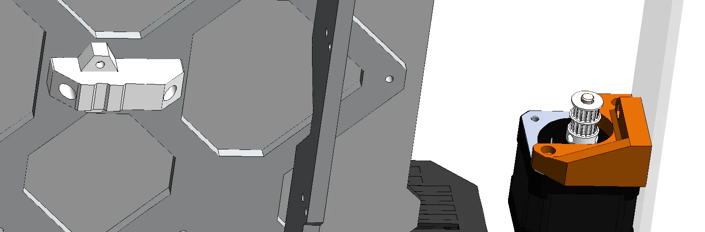

- Take the Y-Belt-Holder-A and install it to the Y carriage using two M3x10 screws as shown. Make sure you have the correct orientation.

### 1.3 Assemble the Y tensioner

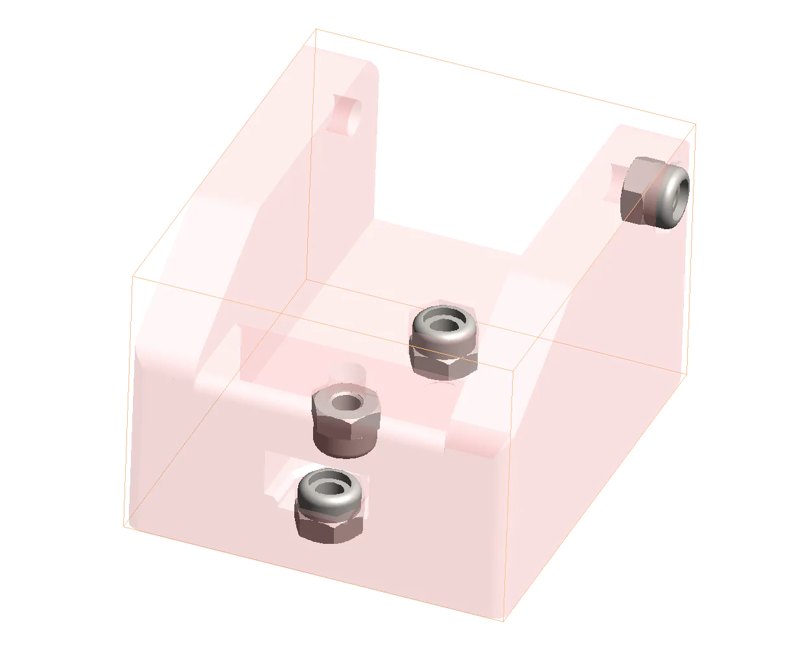

- Push the nylon nut into the Y tensioner base as shown, there are four of them. Make sure you have the correct orientation!

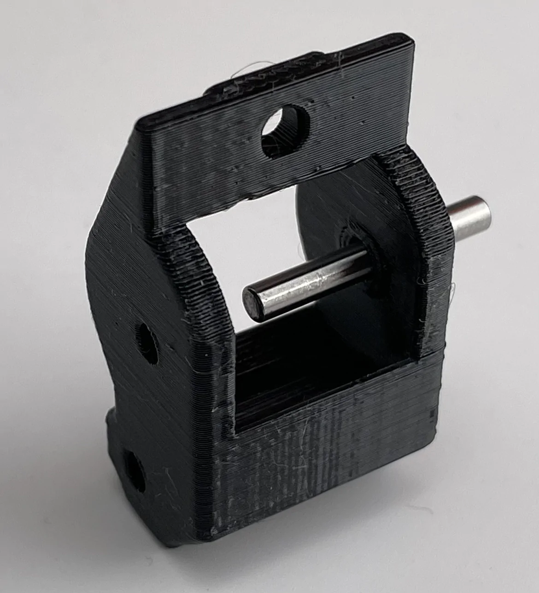

- Insert the pin into the Y tensioner block about 2/3 as shown and be careful with the plastic, do not break it.  

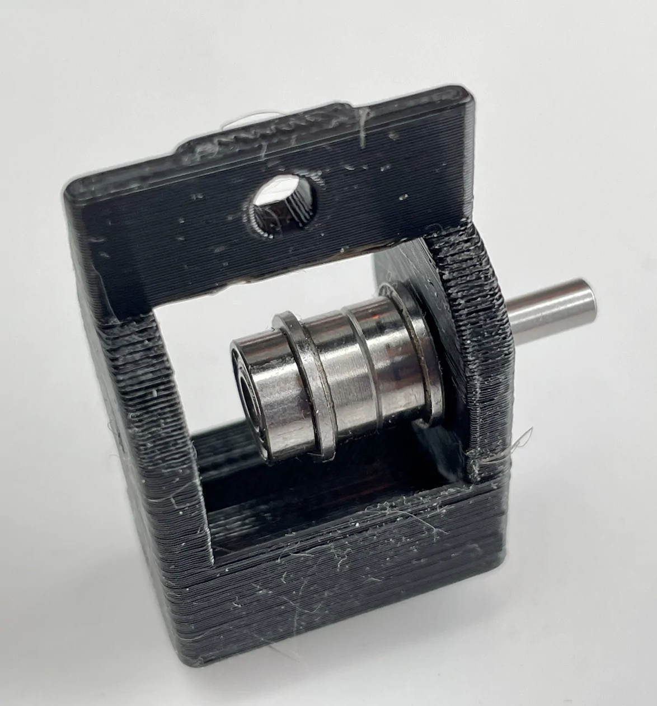

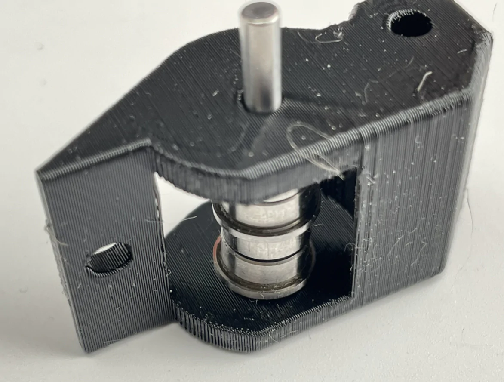

- Put the bearings on the pin as shown. Make sure the bearings have the correct orientation and order.

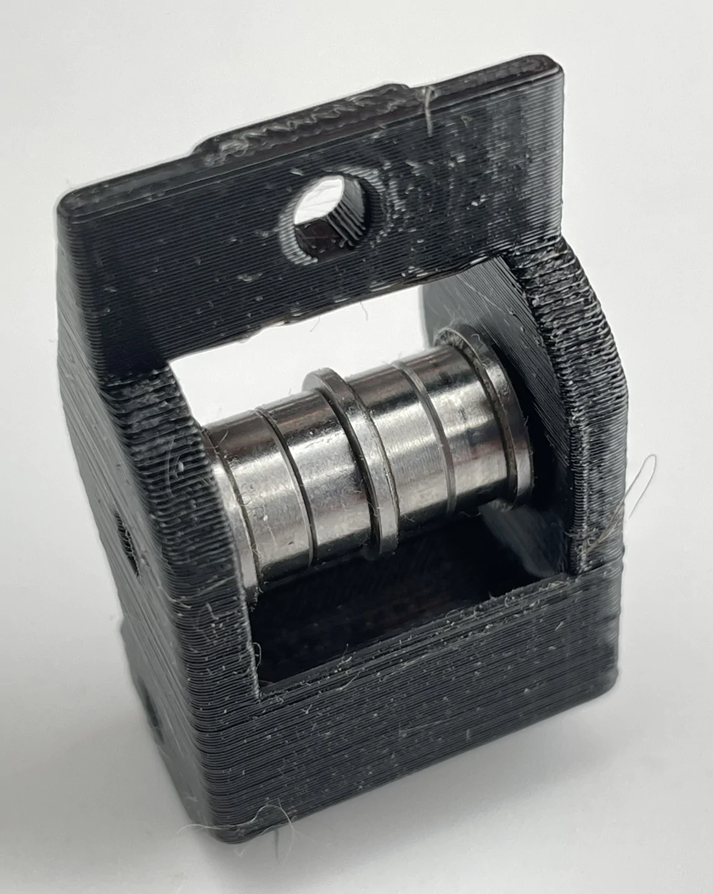

- Insert the whole pin into the Y tensioner.

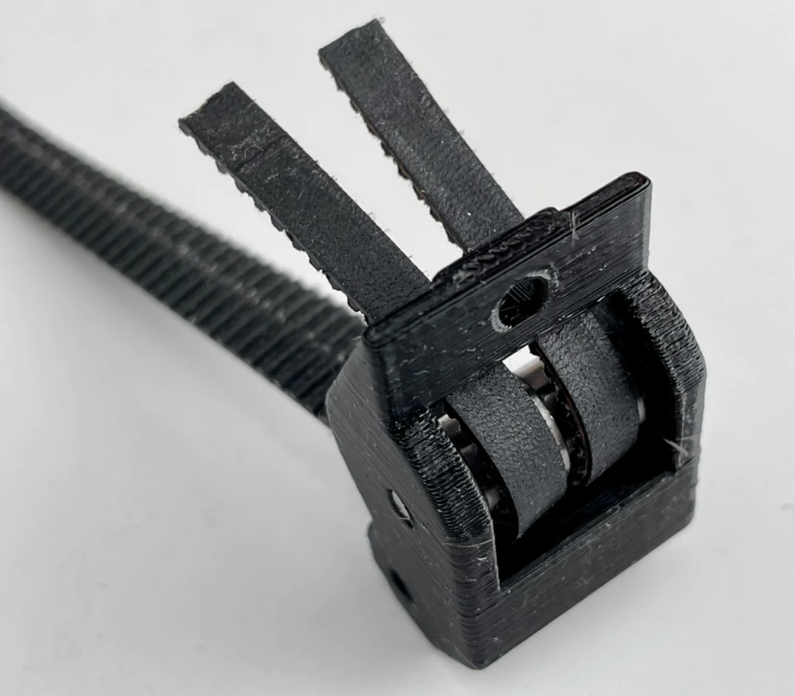

- Pass the two belts through the Y tensioner as shown.

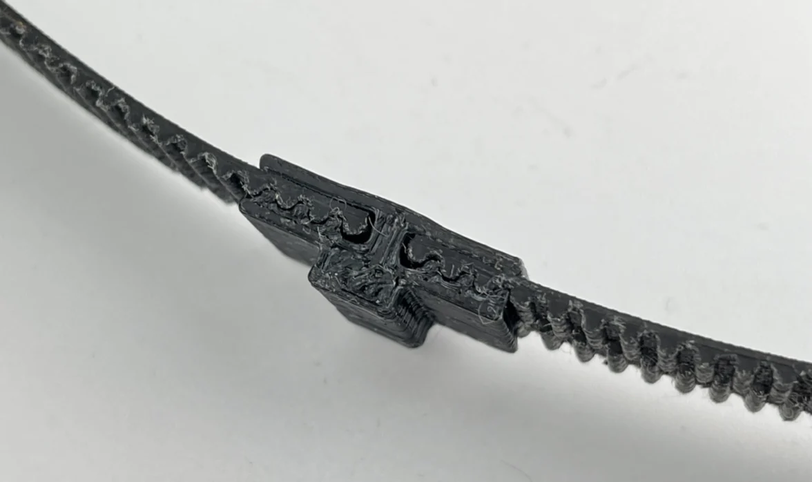

- connect the timing belt as shown. Make sure the belts reach the end. Otherwise, the belt length will be different.

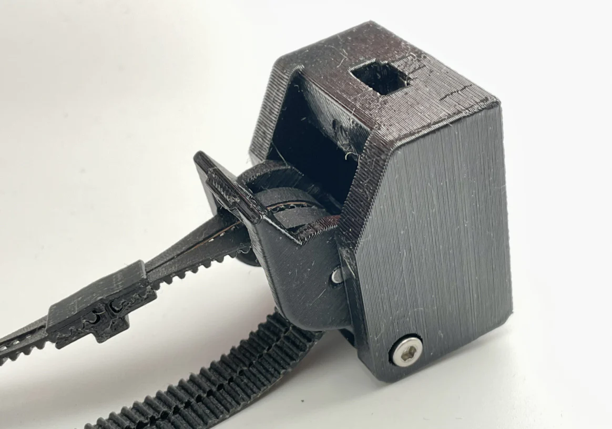

- Insert the M3*32mm screw(the longest one) into the Y tensioner. 

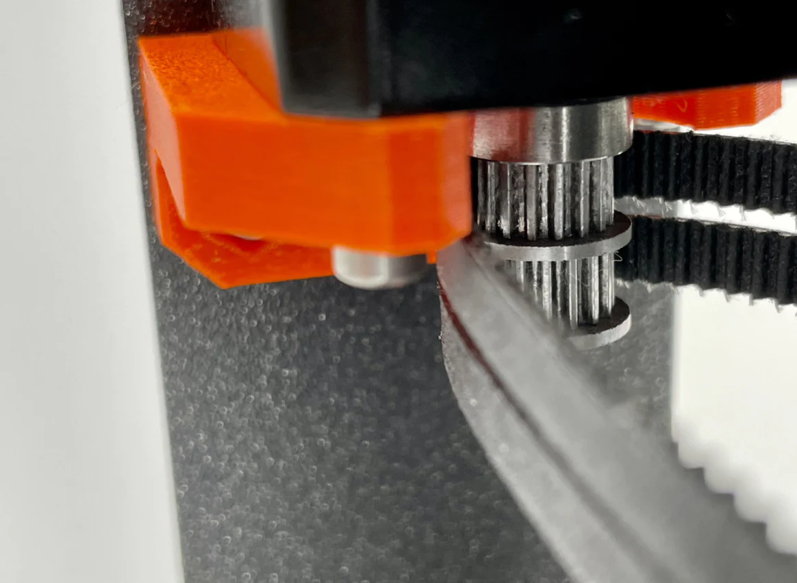

- Install the timing belt into the Y-Belt-Clip as shown. Put 2 M3x12 screws in advance.

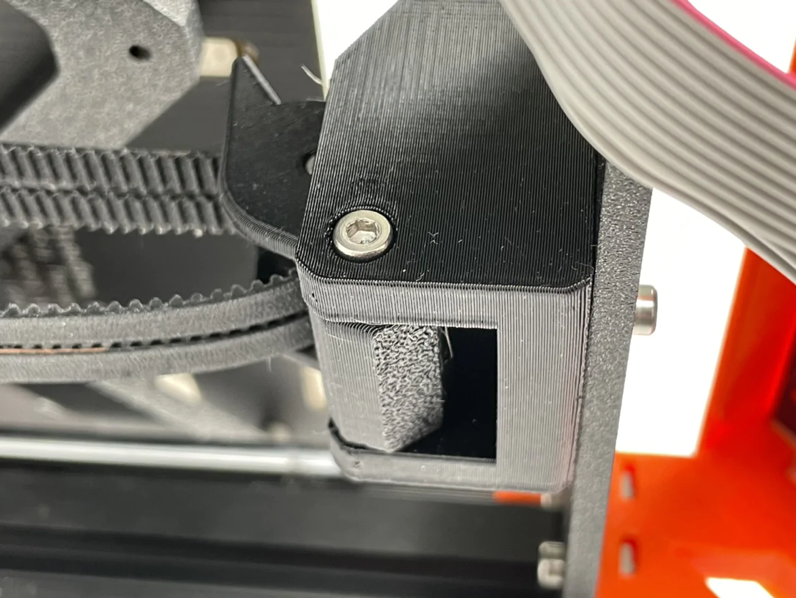

- Put Y Belt Clip into Y Belt Holder B, the upper cover of the Y holder.

- Attach Y Belt Holder B to Y Belt Holder A. Make sure you turn the screws on both sides evenly in turn.

### 1.4 The final assembly

- Put the Dual belt driving pulley on the Y motor shaft, as close to the motor side as possible, leaving a very small gap only. Make sure the pulley is not touching the motor.

- Put the timing belt around the pulley, let the teeth match the belt

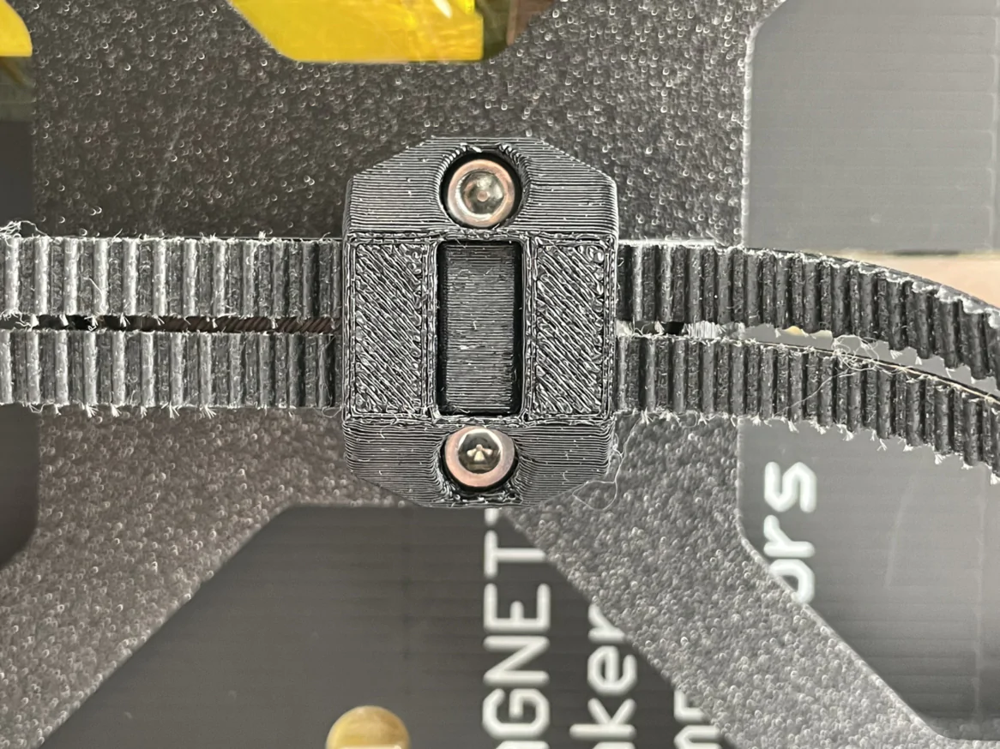

- Install Y tensioner mount to the original position using the original screws. 

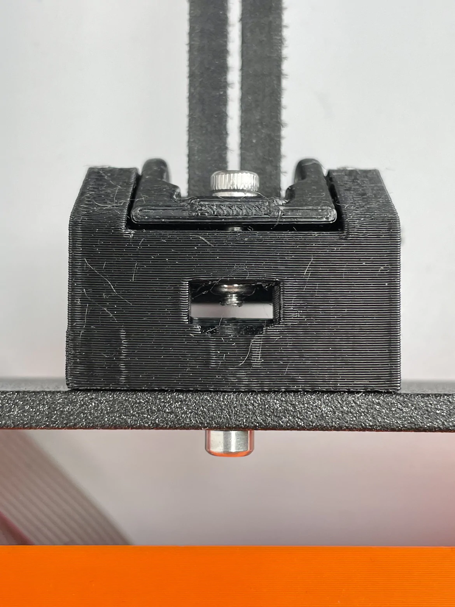

- Install the adjusting screw(M3x12mm) and leave a proper distance. If the belt does not fully match the driving pulley or the left and right belt does not have the same tension. Just move the Y carriage back and forth when the belt is under tension until the two belts are working properly.

- We will fine tune the belt tension later according to the printing test.

