# MINI:Motor Upgrades

## 1. Preparation and disassembly

### 1.0 Introduction

<span style="color:red"> **READ THE INSTRUCTION BEFORE UPGRADE!!** </span>  

- Prorifi3D Upgrade Kit for Original MINI/MINI+ is fully compatible with the Original i3 MINI series firmware and hardware.  

- Since you are upgrading an existing Original MINI or clone, you will have to replace X and Y motors, if you have experience in assembling Original MINI, that’s perfect! if not, don’t worry, follow this guide, and everything will be smooth and fine.  

- Disclaimer: We share these guides to make your experience as smooth as possible. However, you are responsible for your upgrade, assembly, and any damage you cause to your hardware.  

### 1.1 Check before Upgrade

Make sure you have the following tools and things available in the following 15 minutes:  

1. Your Original MINI 

2. 2.5mm, 2mm, and 1.5mm hex keys for disassembly, you can find one 1.5mm hex key in our accessory pack if you do not have one.  

3. A cutting tool for cutting zip ties  

4. Your Prorifi3D motor upgrade kit  

5. A small box for keeping the screws  

6. Printed parts for the new Dual belt Plus (From [Our GitHub](https://github.com/Prorifi3D-Official/Prorifi3D-Upgrades/tree/main/Original%20i3%20series%20Upgrade%20Kits/MINI%20Upgrade/Dual%20Belt/STL))  Note that you will have to change the front and rear plate.

7. Open the Original Prusa MINI kit assembly Guide for reference([https://help.prusa3d.com/guide/1-introduction_203948](https://help.prusa3d.com/guide/1-introduction_203948))

- Make sure the filament is **unloaded** before the upgrade. You will have to turn the printer over during the process so the filament spool and spool holder need to be removed before the upgrade.

- Make sure your printer is **Not powered**, the nozzle and heated bed are fully cooled to room temperature! Otherwise, you may injure yourself!

- Make sure **both** ends of the power cord is unplugged to allow the printer to be placed sidewise.

## 2. Replace X and Y motors  

### 2.0 Disconnect the wires  

- Open the control box anddisconnect the X and Y motor wires.

### 2.1 Remove the X motors

- First you will have to lower the belt tension on the X axis before you replace the X motor. Follow [Step 30](https://help.prusa3d.com/guide/3-x-axis-extruder-assembly_199519#200635) to adjust the belt tension

- To uninstall X motor, please refer to the Original MINI guide from Step19 to [Step 26](https://help.prusa3d.com/guide/3-x-axis-extruder-assembly_199519#200484) 

### 2.2 Remove the Y motors

- First you will have to lower the belt tension on the Y axis before you replace the Y motor. Follow [Step 30](https://help.prusa3d.com/guide/2-yz-axis-assembly_196824#198050) in 2-yz-axis-assembly to adjust the belt tension and remove the current belt system.

- You will then need to remove the front plate by untightening the M5x20r screws. Then carefully take off the front plate and replace it with the new printed one.

- After you replace the front plate, do the same for the rear plate. Then remove the original Y motors on the rear plate.

### 2.3 Install Prorifi3D Motors

- Replace the original Y motor, the Prorifi3D motors has the same size and shape as the original ones, so it should be a direct replacement. Use the original screws.

- Collect and organize the Y motor wires. Make them the same as the original motor wires.

- Put the sleeve on the Prorifi3D X motor wire just like you did for the original motor. Use a zip tile to secure the sleeve position

- Install the Prorifi3D X motor to the original position, carefully put everything back as before. You can refer to the Original MINI guide from [Step19](https://help.prusa3d.com/guide/3-x-axis-extruder-assembly_199519#200201) to Step 26

- Adjust the tightness of the X and Y belt to be not too tight. We can fine-tune the belt tension later according to the print test. 

### 2.4 Reinstall the control box

- Reconnect the XY motor wire you took off previously. Put the cover back and tighten the screws.

- Be careful and make sure the X wire is not pressed or has been snapped by the Control box. 

## 3. Install the Dual Belt Plus 

### 3.1 Install the new MINI Y-Belt-Holder-A

- Insert two nylon nut as shown on MINI Y-Belt-Holder-A

 

- Install the new MINI Y-Belt-Holder-A with M3x12 screws, make sure you have the correct orientation.

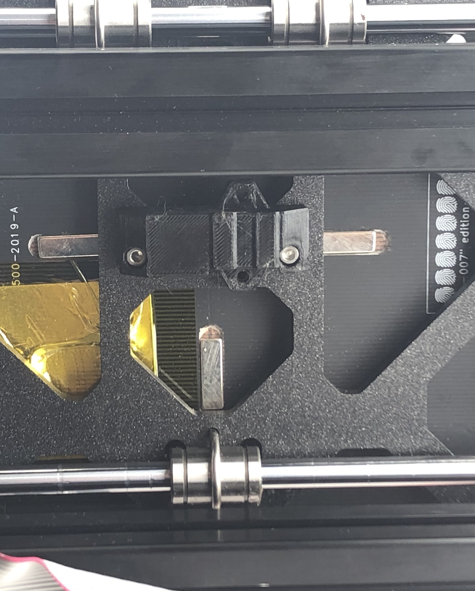 

### 3.2 Assemble the Y tensioner

- Note that the new printed part is not symmetric!

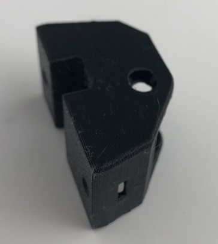 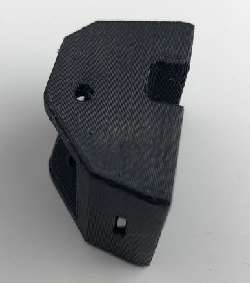

- Insert your hex key into the Y tensioner and place the bearings on the hex key one by one as shown. Guide the bearings and insert the hex key all the way through the Y tensioner. Note that you shall insert from the side which is not chamfered.

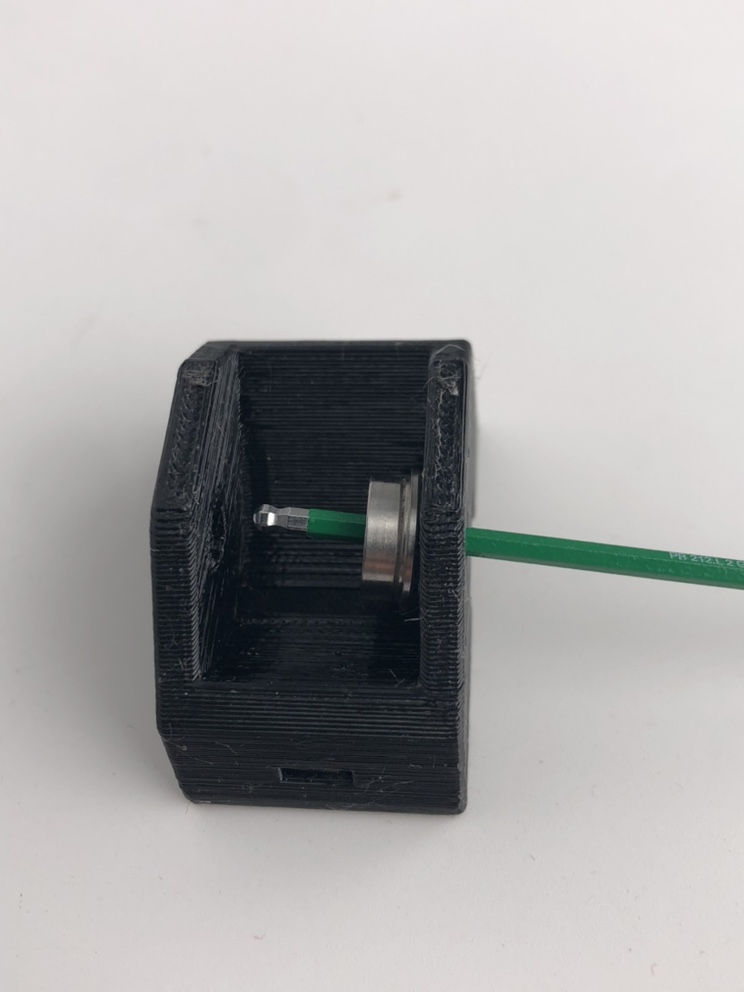

- The bearings should look as shown.


- Now, insert the pin from the **chamfered side** and use the pin to replace and push the hex key out of the bearings. 


- Insert the pin all the way to the end. Use a 3mm hex key to assist and make sure the pin is at the end.

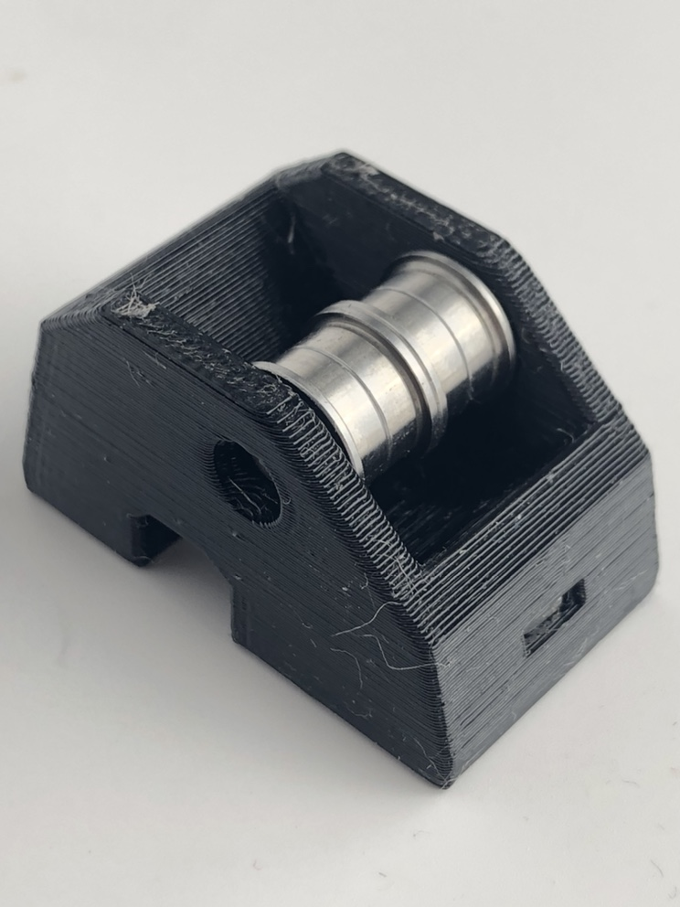

- Insert the M3 square nuts into the Y tensioner. The installation location is the same as the original one. 

- The new Dual Belt Plus tensioner is complete!

- Pass the two belts through the Y tensioner as shown.

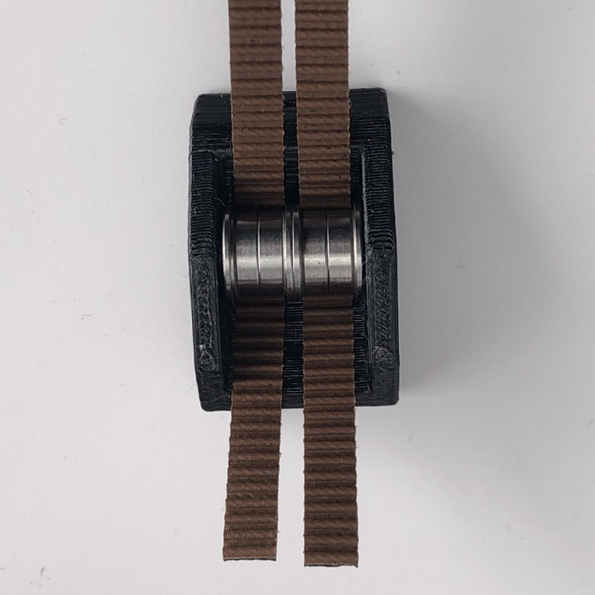

- Connect the timing belt as shown. Make sure the belts reach the end. Otherwise, the belt length will be different.


- Replace the driving pulley with the new Dual Belt Plus version. Leaving only a small gap between the pulley and motors. 

- Pass the belt on the motors as shown.

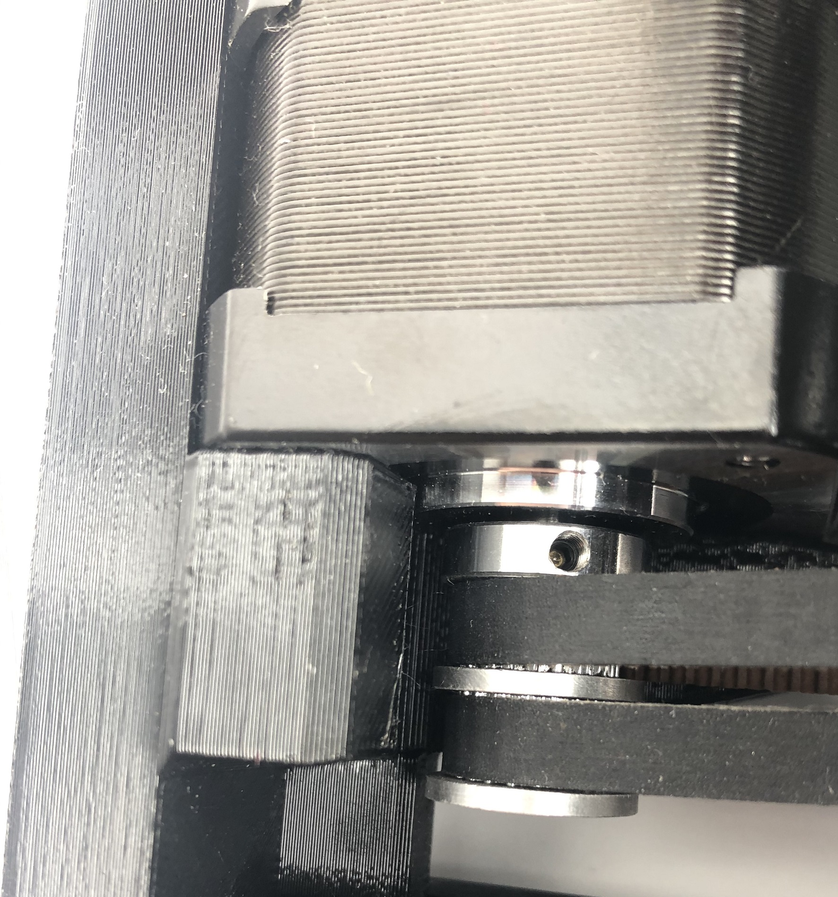

- Install the timing belt into the Y-Belt-Clip as shown. Put 2 M3x12 screws in advance.


- Put Y Belt Clip into MINI Y Belt Holder B, the upper cover of the Y holder.

- Attach MINI Y Belt Holder B to MINI Y Belt Holder A. Make sure you turn the screws on both sides evenly in turn.


- Install the Y tensioner with 2 M3*20 screws.

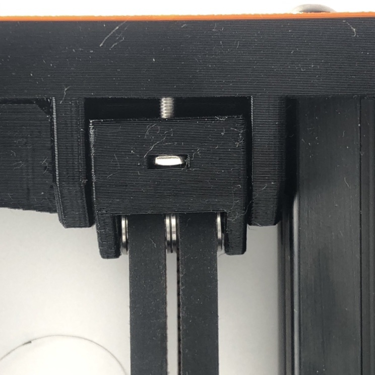

## 4. Belt tension adjust

- You can use phone apps to measure the belt vibration frequency.

- When measuring the belt frequency, push the heated bed all the way to the back (where the motor is). Slightly picking the lower belt in the middle as shown. You can use a hex key to assist. For the dual belt system you only need to pick one of the belts.

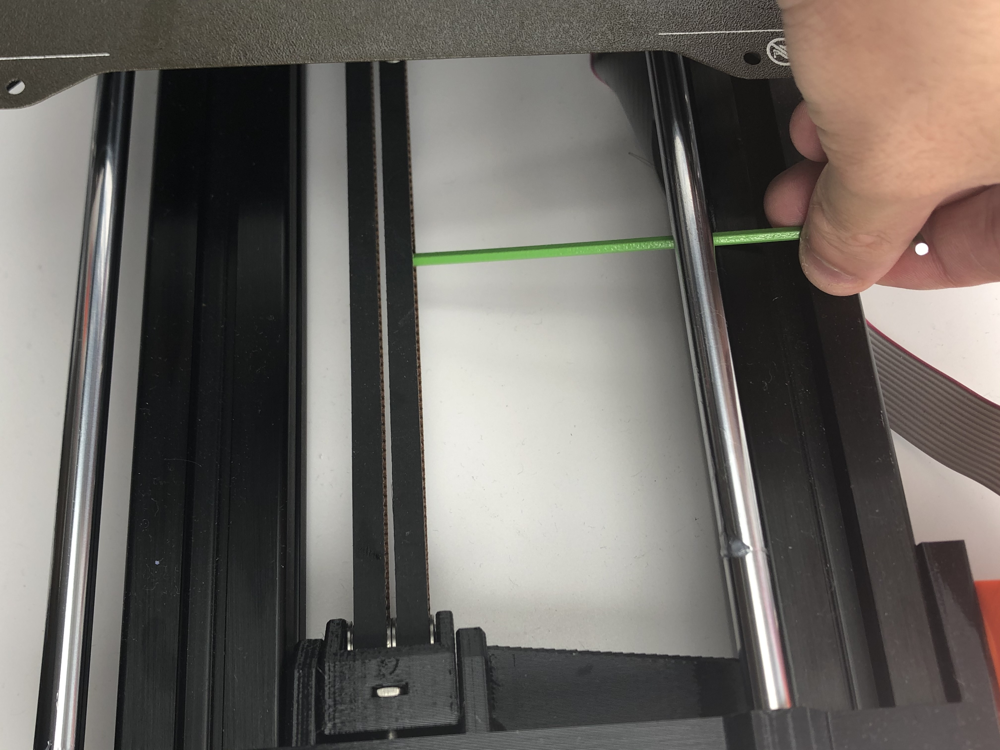

- Adjust the belt tension to around 75Hz, move the Y axis and remeasure the belt frequency. Make sure the belt frequency is stable after your adjustment.


## 5. Performance boost 

### 5.1 Install the heat sinks

- To get an extra performance boost, you can install the heatsink first. This will lower the motor running temperature, allowing a larger current and better stability.

- Clean the mounting surface before you install the heatsinks. 

- For Y motors we recommend you install as shown:

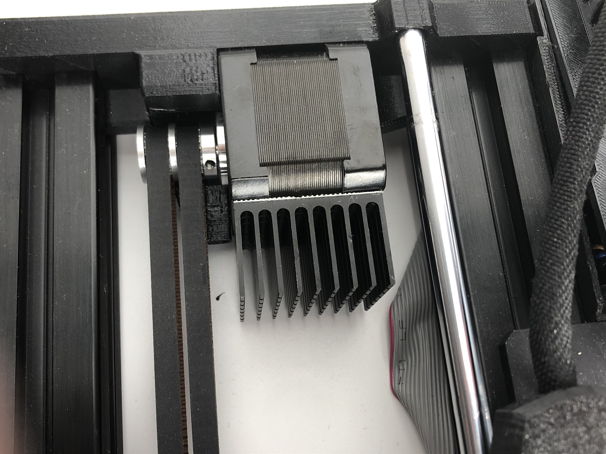

- For X motors we recommend you install as shown:

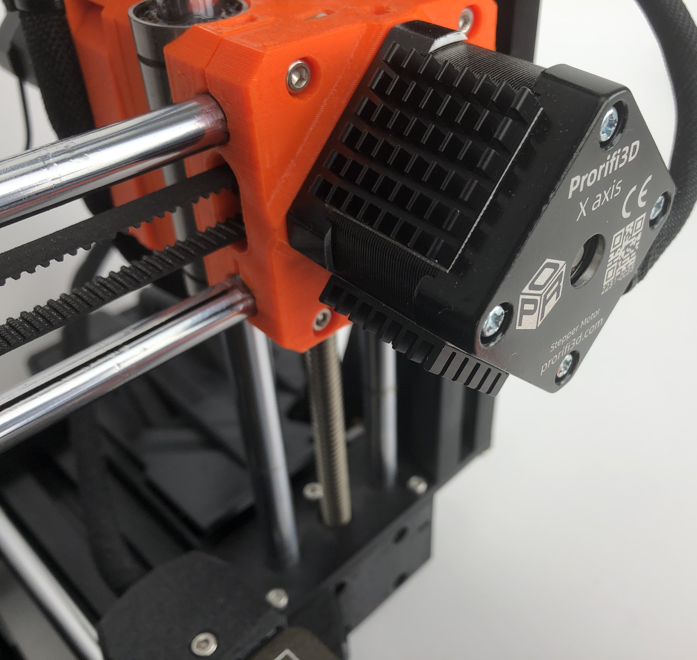

### 5.2 Changing the motor current

- You can change the current via G-code

- For the Original MINI, you can do this by adding custom Start Gcodes in the slicer software

- Change the RMS current of your XY motor by adding

```
M906 X520 Y520
```

- Change the steps per unit of Y axis by adding

```
M92 Y80
```

Note that you should put these extra code before doing mesh bed leveling!

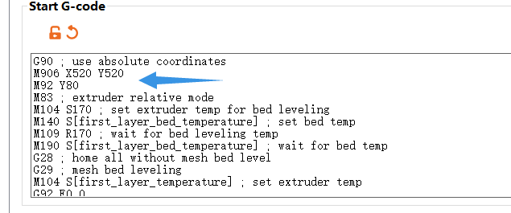

- Save this preset and use it as default, to change current **without** modifying the firmware, you will have to add these custom Gcodes in each print!

### 5.3 Test Print

- Print the [Test block](https://github.com/Prorifi3D-Official/Prorifi3D-Upgrades/tree/main/Test%20files) after you finishe all the necessary setup.

