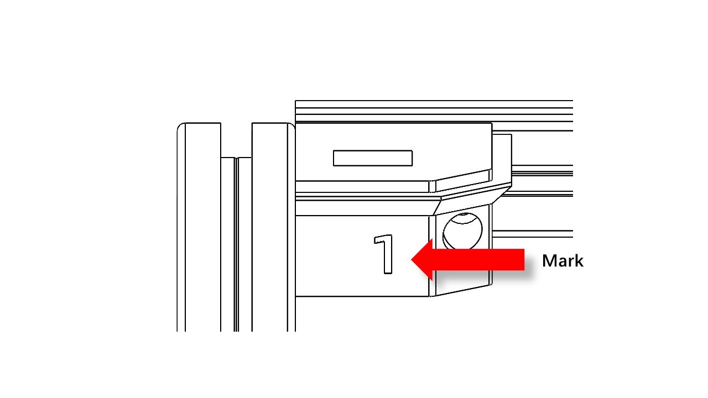
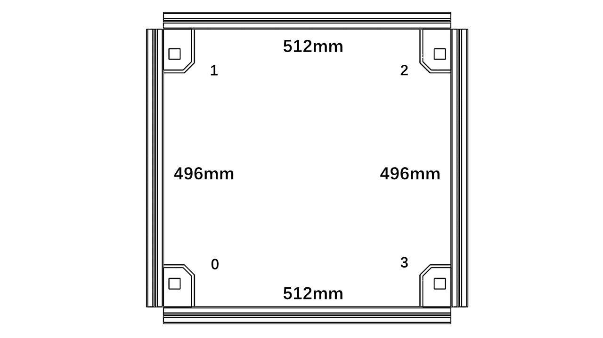
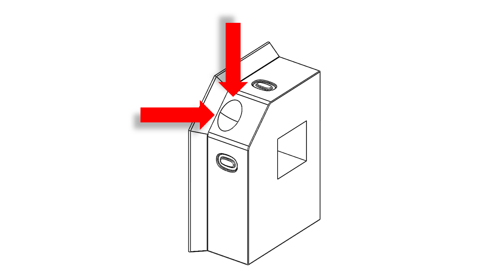

# P350 Kit

## 1. Preparation before Assembly

### 1.0 Introduction

 **READ THE INSTRUCTIONS BEFORE ASSEMBLY!!**  

The P350 features a modular design and comprises the following main modules:

- Frame

- Zdrive

- Gantry

- Tool Head

- Heated Bed

- Enclosure(optional)

- Each can be pre-assembled separately.

- However, we recommend assembling in the following order:

- Frame, Zdrives, Gantry, Tool Head, Heated Bed,  Electronics.

## 2. Frame

### 2.0 Check before the assembly

#### 2.0.1 Printed parts 

- The printed parts required in this section contain:

- frame_down_left_front_corner (1pcs)

- frame_down_right_front_corner (1pcs)

- frame_down_left_rear_corner (1pcs)

- frame_down_right_rear_corner (1pcs)

- frame_up_left_front_corner (1pcs)

- frame_up_right_front_corner (1pcs)

- frame_up_left_rear_corner (1pcs)

- frame_up_right_rear_corner (1pcs)

- frame_rail_support (4pcs)

- Fixture: MGN12 fixtures (2pcs)

- Fixture: corner fixtures (4pcs)

Metal Parts:

- T-Slot 3030 Aluminium Profile (12pcs in total)

- MGN12 450mm with MGN12H Blocks (4pcs) 

#### 2.0.2 Bolts and nuts

The bolts and nuts required in this section contain:

- M8 x 16 Button Head Cap Screws (16pcs)

- M5x30  Screw (16pcs)

#### 2.0.3 Tools

The tools required in this section contain:

- Hex(5mm)

- Hex(4mm)

#### 2.0.4 Workspace requirements

The recommended working space needs to be as flat as possible. A minimum 2m x 1m space is recommended for placing the parts and tools

#### 2.0.5 Aluminium:

Take out the extruded Aluminum from the Frame box carefully. 

### 2.1 Bottom Frame

#### 2.1.0 Assemble

Note that the key to a good and correctly built frame is flatness and alignment.

In this section, the flat surface you have and the printed part will work as fixtures. They will help you align the frame. 

Here are the fixtures you will need:

(pic)

First, take and place the parts for the bottom frame as follows. Note that there are marks on the printed parts to indicate the orientation.

Use the fixture to help you align the Aluminium profile. The boss on the fixture should fit nicely into the slots of the profiles.

Then put the M8 screws on. Tighten the screws against the table using the four corner fixtures.

Insert an M5x30 screw into the printed parts, and attach the T-nut (3030 M5).

For T-nut, you should always make sure it is turned 90 degrees correctly before tightening.

You can check this [video](https://youtu.be/_kZTA5S2jWY?si=gpDFgc6bVI7_g-RN) to see how it is done.

