# 测试台Guide

# 测试台 Guide

# Printer Test Bench Guide

**Version:** R0.3 Draft

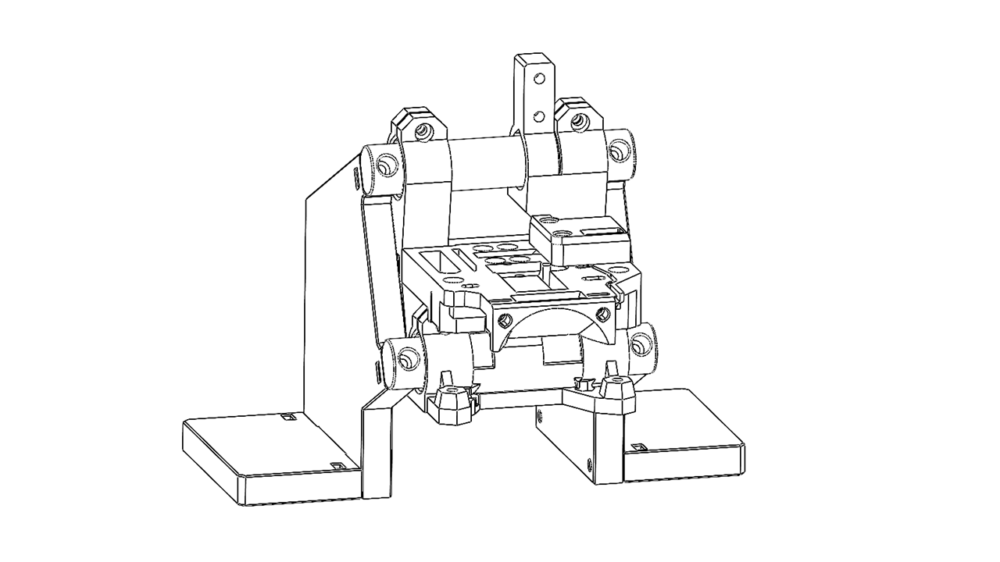

> **Document purpose:** This guide covers the assembly, bring-up, calibration, and use of the Printer Test Bench. The bench uses a **P350 Basic Tool Head** as the standard test module.

---

## Contents

*   [0. Before You Start](#0-before-you-start)
    
    *   [0.1 Package Scope: Included and Customer-Supplied Components](#01-package-scope-included-and-customer-supplied-components)
        
    *   [0.2 Intended Use and Test Scope](#02-intended-use-and-test-scope)
        
    *   [0.3 Estimated Time and Difficulty](#03-estimated-time-and-difficulty)
        
    *   [0.4 Guide Symbols](#04-guide-symbols)
        
*   [1. Modular Assembly Overview](#1-modular-assembly-overview)
    
*   [Part I — Mechanical Assembly](#part-i--mechanical-assembly)
    
    *   [2. Test Bench Frame](#2-test-bench-frame)
        
        *   [2.1 Before Assembly](#21-before-assembly)
            
        *   [2.2 Printed Part Preparation](#22-printed-part-preparation)
            
        *   [2.3 Vertical Support Installation](#23-vertical-support-installation)
            
        *   [2.4 Completion Check](#24-completion-check)
            
    *   [3. P350 Tool Head Installation](#3-p350-tool-head-installation)
        
        *   [3.1 Tool Head Preparation](#31-tool-head-preparation)
            
        *   [3.2 Required Preassembled Items](#32-required-preassembled-items)
            
        *   [3.3 Mount the Basic Tool Head](#33-mount-the-basic-tool-head)
            
        *   [3.4 Tool-Head Cable Pre-Routing](#34-tool-head-cable-pre-routing)
            
*   [Part II — Bring-Up and Testing](#part-ii--bring-up-and-testing)
    
    *   [4. Hot End and Extruder Installation](#4-hot-end-and-extruder-installation)
        
    *   [5. Firmware / Software Installation](#5-firmware--software-installation)
        
    *   [6. Calibration](#6-calibration)
        
    *   [7. Test Procedures](#7-test-procedures)
        
    *   [8. Getting Help and Test Records](#8-getting-help-and-test-records)
        
        *   [8.1 When You Need Help](#81-when-you-need-help)
            

---

# 0. Before You Start

## 0.1 Package Scope: Included and Customer-Supplied Components

The Printer Test Bench is a modular test fixture. The test-bench fixture and the supplied P350-related hardware cover the **Tool Head (TH) section, sensor section(included in the TH), and ESP board/interface section**.

> ⚠️ **Important — Customer-Supplied Components:** The test bench does **not** include a complete extrusion and printer-control system. The buyer must provide the following components.These components are required before bring-up, calibration, and functional testing can be completed.

### Who is this for?

*   Makers who want to research, develop, or evaluate systems using P350 Basic Tool Heads.
    
*   Technicians performing repeated functional, endurance, or sensor tests.
    
*   Users who want to build or experiment with a custom 3D-printer test setup.
    

### Who might reconsider?

*   First-time 3D-printing users with no experience assembling, wiring, or configuring printer hardware.
    

---

## 0.2 Intended Use and Test Scope

### The bench is intended to test

*   Flow condition
    
*   Hot-end flow response
    
*   Extrusion force
    

### Environmental limits

| Item | Requirement |
| --- | --- |
| Ambient temperature | Room temperature |
| Work surface | Flat, stable, and non-combustible |
| Ventilation | Adequate ventilation when testing ABS or similar materials |

---

## 0.3 Estimated Time and Difficulty

| Stage | Estimated time | Key challenge | Experience needed |
| --- | --- | --- | --- |
| 1. Test Bench Frame | 10 min | Alignment and rigidity | Basic hands-on experience |
| 2. Basic Tool Head | 5 min | Correct interface and cable clearance | P350 familiarity helpful |
| 3. Wiring and Control Hardware | 10 min | Pinout verification | Electrical-safety awareness |
| 4. Calibration | 15 min | Repeatable datum and measurement | Careful measurement |
| **Total** | **\[FILL IN\]** |  |  |

We recommend validating each module before moving to the next stage.

---

## 0.4 Guide Symbols

| Symbol | Element | Purpose |
| --- | --- | --- |
| 🔵 | **Completion Criteria** | The exact condition that confirms the step is complete. |
| 🟡 | **Common Mistake** | A frequent error and how to avoid it. |
| 🔴 | **Rollback** | The minimum disassembly or adjustment needed to correct an error. |
| ✔️ | **Note** | Helpful information or a reminder. |
| ⚠️ | **Caution** | Risk of part damage, unreliable results, or significant rework. |
| ☠️ | **Danger** | Risk of injury, fire, electrical shock, or catastrophic damage. |
| `- [ ]` | **Check Box** | Used to record progress and inspection status. |

---

# 1. Modular Assembly Overview

The Printer Test Bench is divided into independently verifiable modules. A problem in one module should not require a complete rebuild of the entire test bench.

| Module | Contents | Completion criteria |
| --- | --- | --- |
| 1. Test Bench Frame | Base, vertical support, structural parts, and covers | Bench is rigid and stable on a flat surface |
| 2. P350 Tool Head | P350 Basic Tool Head, sensor components, and bench mounting hardware | Tool Head is retained, aligned, and removable |
| 3. Extrusion Hardware | Customer-supplied extruder, motor, hot end, and cooling hardware | Components are securely installed and mechanically aligned |
| 4. Wiring and Control Hardware | Supplied ESP board/interface hardware and customer-supplied controller board | Connections are verified and strain-relieved |
| 5. Firmware / Test Interface | Configuration, controls, and communication interfaces | Software connects and devices respond correctly |
| 6. Calibration | Extrusion and sensor reference procedures | Required calibration steps are completed |

---

# Part I — Mechanical Assembly

# 2. Test Bench Frame

## 2.1 Before Assembly

### Printed parts

*   Base plate — 2pcs
    
*   Side plate — 2 pcs
    
*   Support Beam — 2 pcs
    

### Fasteners

*   M3 square nut (thin) — 8 pcs
    
*   M3 x 18 — 4 pcs
    
*   M3 x 14 — 4 pcs
    

### Tools

*   2.0 mm and 2.5 mm hex keys
    
*   Flat, stable work surface
    

### Workspace

*   Flat work surface at least 200 mm x 200 mm
    
*   Minimum clearance around the bench: 100 mm
    

---

## 2.2 Printed Part Preparation

**Estimated time:** 5 min

1.  **Inspect the base plate.** Confirm that all mounting holes, slots, and locating features are free of debris.
    
2.  **Identify the front and rear.** Position the base plate as shown. Orient the frame so that the indicated front side faces you.
    
    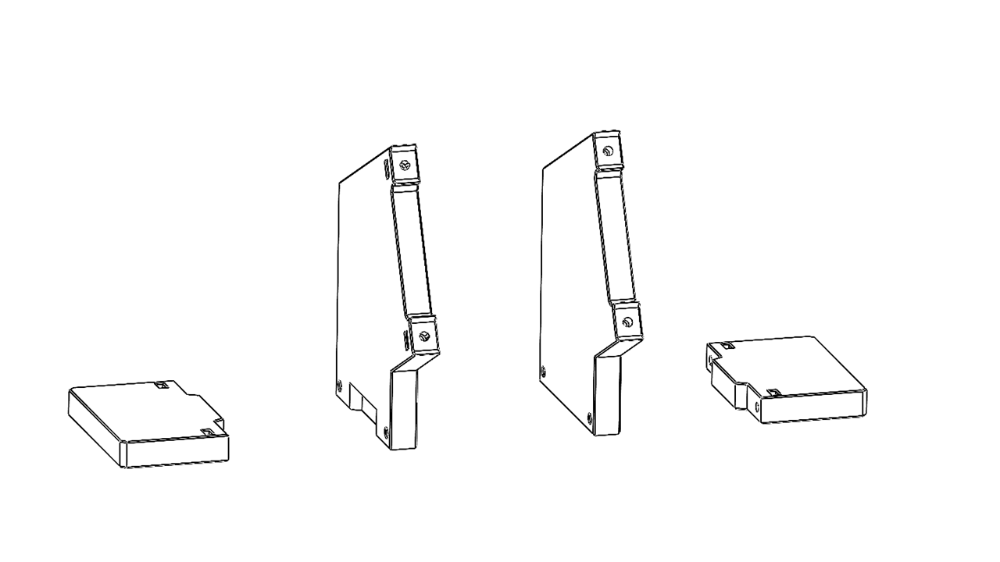
    
3.  **Insert the square nuts.** Insert the M3 thin square nuts into the indicated slots, as shown.
    

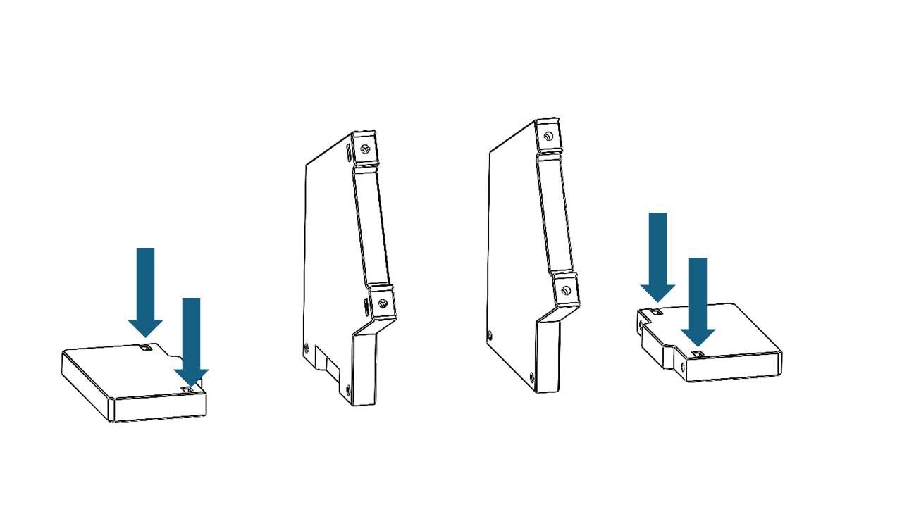

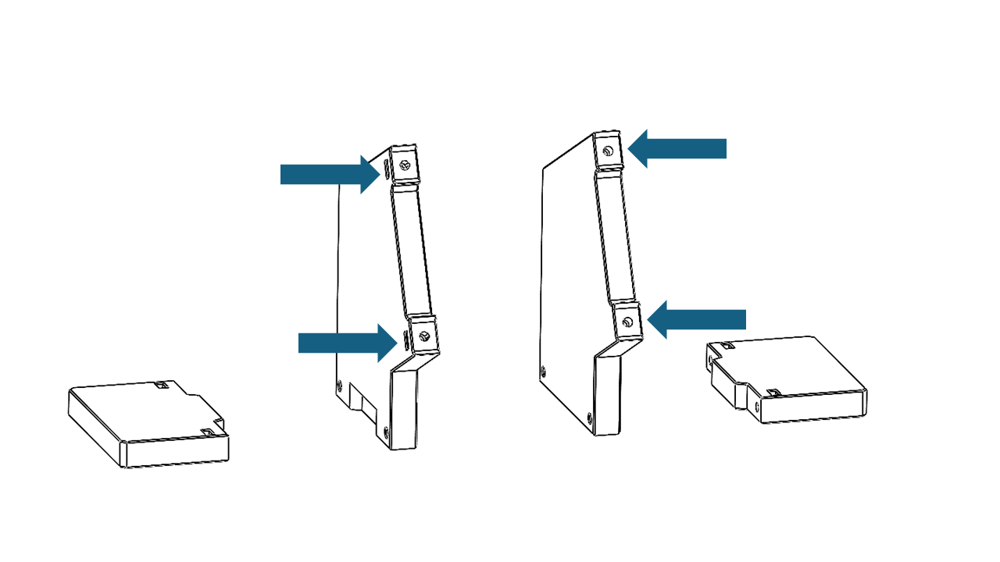

> 🟡 **Common Mistake:** Forgetting to insert the square nuts before installing the next part.

> 🔵 **Completion Criteria:** All required square nuts are fully inserted and correctly positioned.

---

## 2.3 Vertical Support Installation

**Estimated time:**  5 min

1.  **Position the vertical support.** Fit the vertical support onto the base plate as shown. Make sure the mating slots and locating features are aligned.
    
    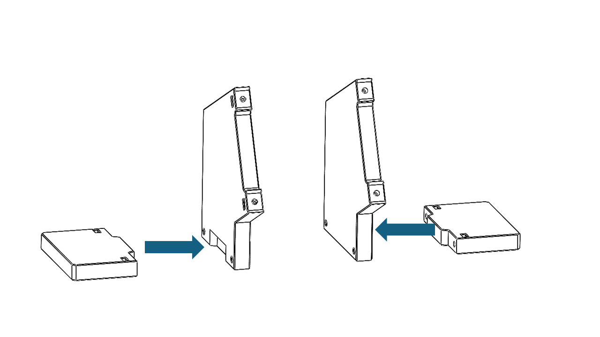
    
2.  **Tighten in sequence.** Install the M3 × 18 mm screws and tighten them in the order shown, on both sides.
    

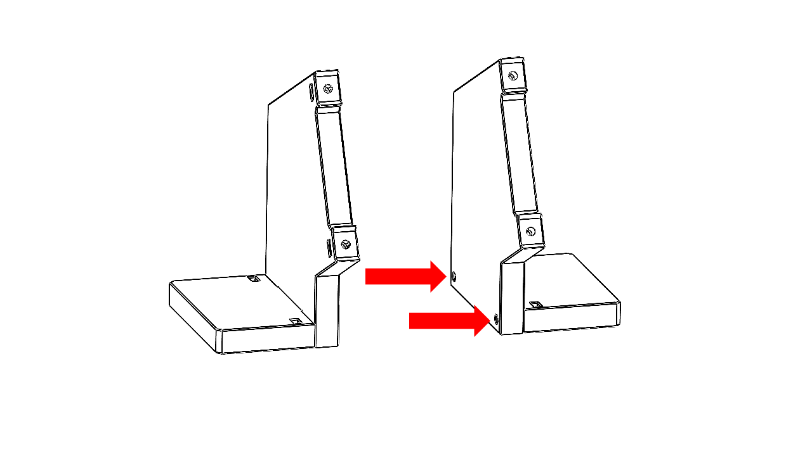

> 🔵 **Completion Criteria:** The vertical support is fully seated, does not visibly tilt, and does not move when moderate hand force is applied.

---

## 2.4 Completion Check

Before continuing to Chapter 3, confirm the following:

*   [ ] The bench frame is rigid and sits flat without rocking.
    
*   [ ] All main structural parts are installed in the correct orientation.
    
*   [ ] All required access panels or covers can be removed as intended.
    
*   [ ] There are no sharp edges, trapped wires, or loose fasteners.
    
*   [ ] The Tool Head mounting points are ready for Chapter 3.
    

---

# 3. P350 Tool Head Installation

## 3.1 Tool Head Preparation

1.  Prepare the P350 Basic Tool Head shown below.
    

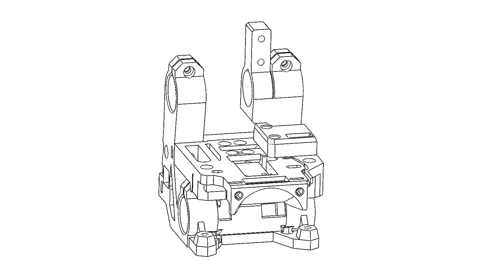

---

## 3.2 Required Preassembled Items

*   P350 Basic Tool Head Module — 1 pcs
    
*   Support beams — 2 pcs
    

---

## 3.3 Mount the Basic Tool Head

1.  **Orient the Tool Head.** Insert the support beams as shown.
    
    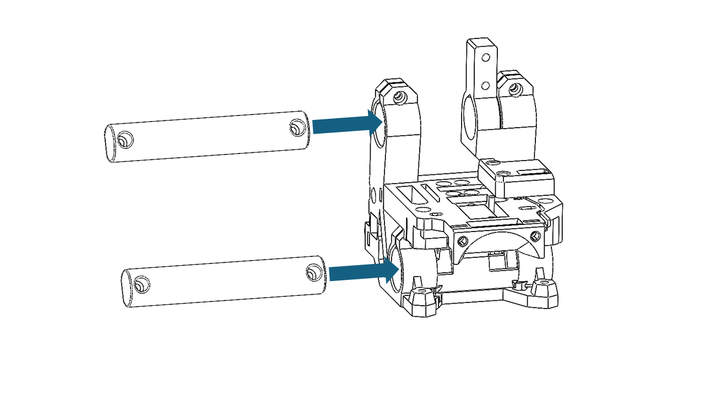
    
2.  **Secure the support beams.** Fasten the support beams using M3 × 14 mm screws.
    

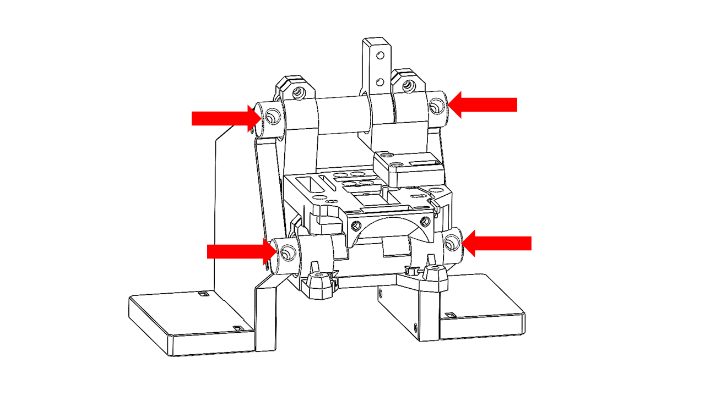

---

## 3.4 Tool-Head Cable Pre-Routing

1.  Locate the signal cable and connect it to the designated pins on the Tool Head PCB.

    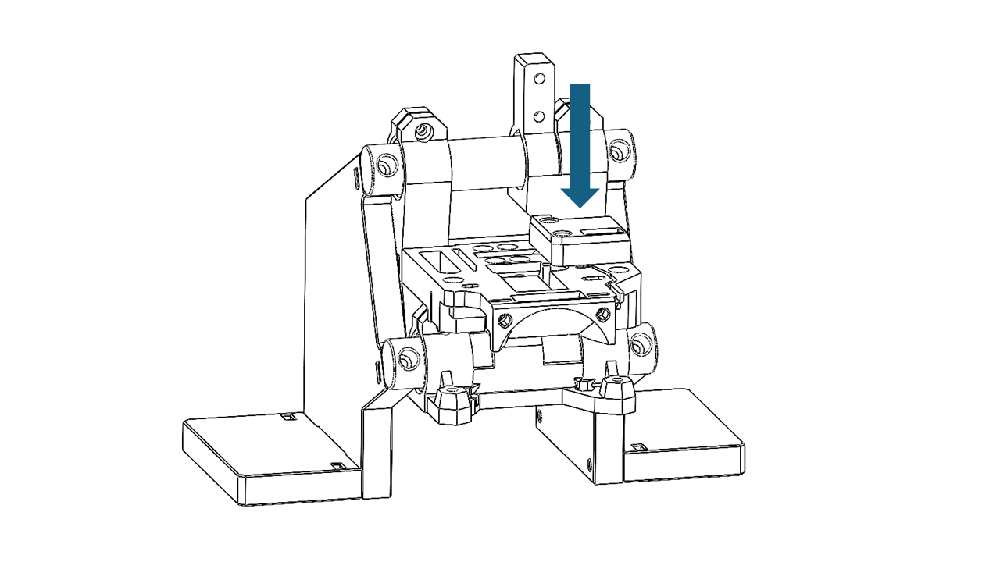
    
2.  Locate the ESP board and connect the other end of the signal cable as shown.
    
3.  Connect the USB Type-C cable to the ESP board as shown. This connection will be used later for serial-port monitoring.

    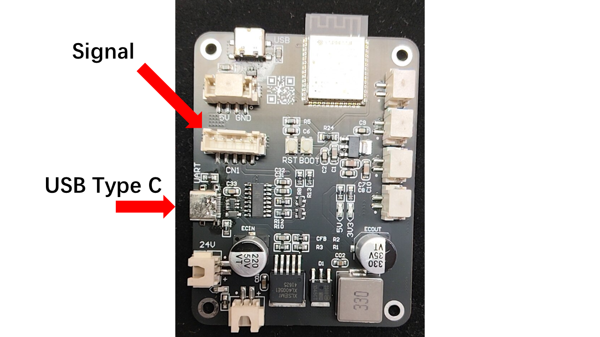
    

---

# Part II — Bring-Up and Testing

# 4. Hot End and Extruder Installation

> ⚠️ **Customer-Supplied Hardware:** The **extruder, extruder motor, hot end module, and 3D-printer controller board/mainboard are not included** with the test bench.

1.  The P350 Tool Head is compatible with mainstream extruders such as the Serpha Mini and Galileo 2.0. The extruder and its motor must be supplied by the buyer.
    
2.  Install the extruder in the orientation shown.
    
    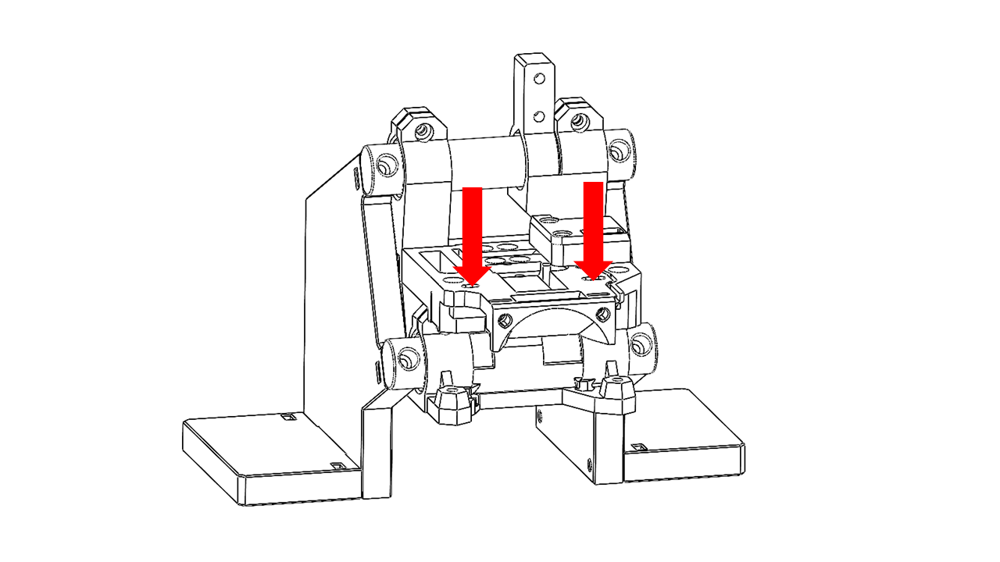
    
3.  The Tool Head is also compatible with mainstream hot ends such as the E3D V6. Hot-end configurations with mounting-hole center spacing of **13.16 mm or 16 mm** can be mounted on the Tool Head. Install the selected hot end as shown. Make sure your hotend is pre assembled with heating element and thermistor.
    
    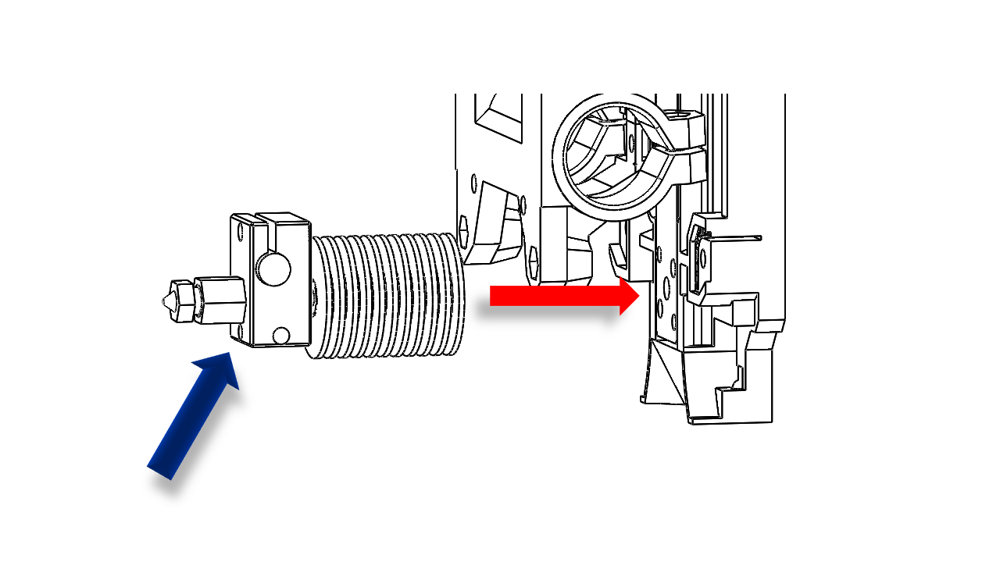
    
    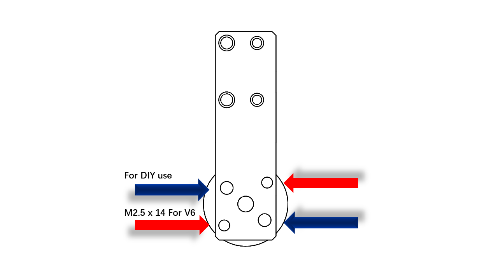
    
4.  After installing the hot end, install the hot-end cooling fan as shown.
    
    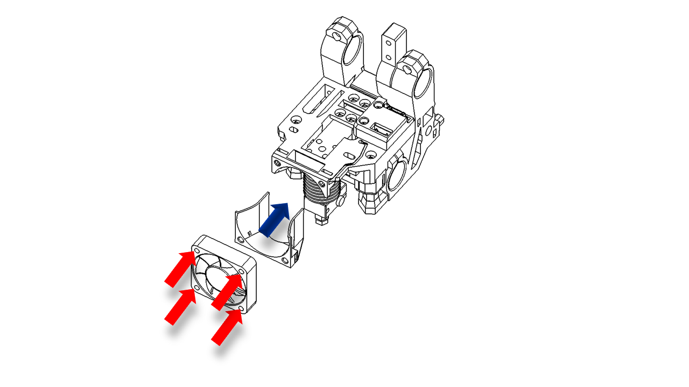
    
5.  Complete the extruder installation. The P350 extruder is shown only as an installation example.
    
6.  Prepare a compatible 3D-printer controller board for the electrical bring-up. The controller board/mainboard is customer-supplied.
    
7.  Connect both the USB from ESP and from the Marlin compatible main board to your PC.
    
8.  Find the Port they are useing. You can check via system device.
    

---

# 5. Firmware / Software Installation

1.  Prepare a customer-supplied Marlin-compatible 3D-printer controller board and flash the required Marlin firmware. This part please refer to the official website of your own mainboard. 
    
2.  We will suggest you use the following settings : baud rate 1152000. 
    
3.  Make sure you corretly set up your exturder in your marlin system. Please refer to the offcial web of Marlin and do all the calibration and settings.
    
4.  Download the complete portable test software package: [FSL Auto Test for Windows x64 (2026.08.17)](./src/assets/Test_Bench/FSL-Auto-Test-Windows-x64-2026.08.17.zip).
    
5.  Extract the complete ZIP file to a writable local folder. Keep `FSL Auto Test.exe` and the `_internal` folder together.
    
6.  Double-click `FSL Auto Test.exe` to start the test application. Python and the required libraries are included in the portable package.
    
7.  Make sure both USB connections are plugged in: one from the controller board and one from the ESP board.
    
8.  Identify the COM ports used by the controller board and ESP board. You can check them in Windows Device Manager.
    
9.  Select the correct ports in the test software. (Also the baud rate)

    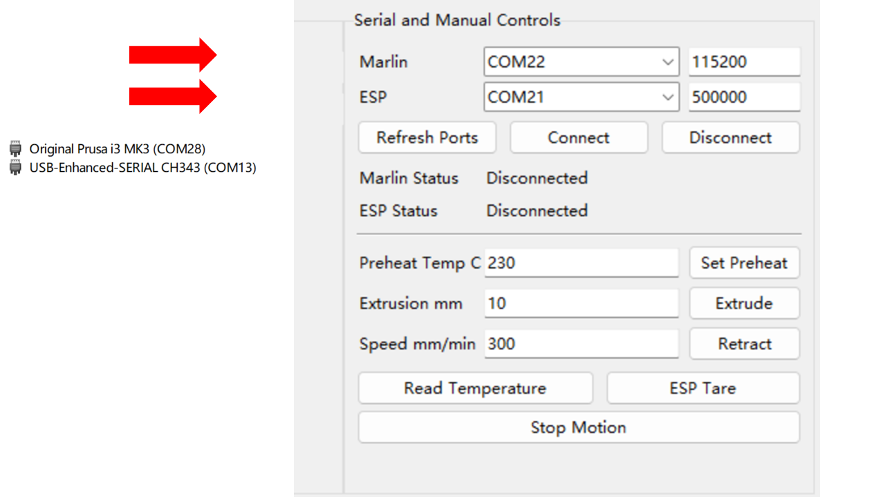
    
10.  Click **Connect** and wait for the connection to complete. When the connection is successful, the status indicator will update and temperature/PWM data should become available. You should see things like these.

    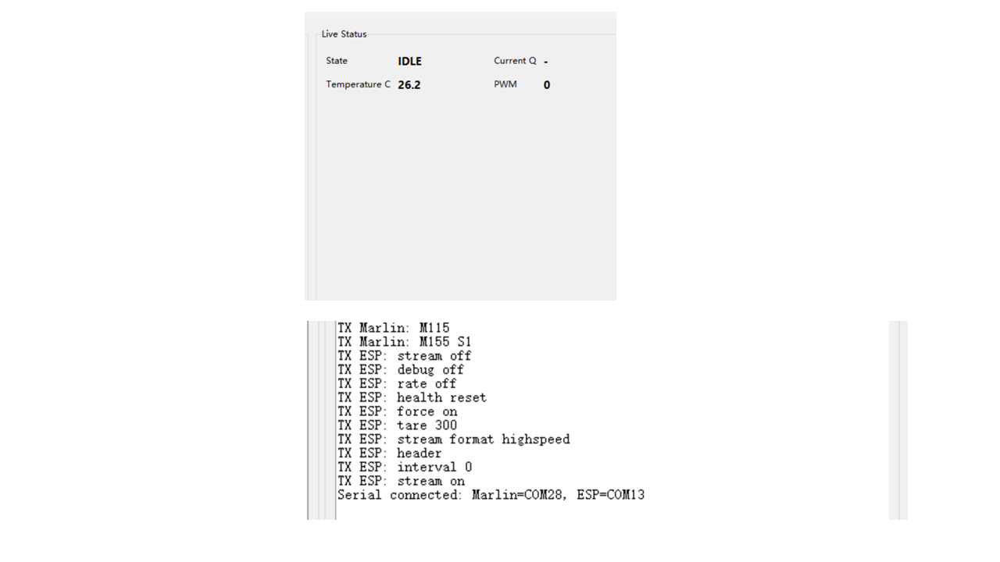
    
11.  If any error occur, replug both USB and do the connection again.
    
12.  After communication is confirmed, continue to calibration.
    

---

# 6. Calibration

1.  Configure the extruder correctly according to the documentation for your controller board and stepper driver. Confirm that the extruder motor current and extrusion steps are correct. Make sure the extrusion direction are correct.
    
2.  Perform the extrusion-length calibration before beginning the test-bench calibration procedure.
    
3.  Reference: [https://www.3dmakerengineering.com/blogs/3d-printing/estep-calibration](https://www.3dmakerengineering.com/blogs/3d-printing/estep-calibration)
    

---

# 8. Getting Help and Test Records

## 8.1 When You Need Help

Record the following information before requesting support:

*   Test bench revision and serial number
    
*   Basic Tool Head revision and serial number
    
*   Firmware / configuration version
    
*   Exact failed step or test ID
    
*   Actual result and acceptance limit
    
*   Relevant photo or video
    
*   Relevant log or CSV file
    
*   Corrective action already attempted
    

**Support location:** `[FILL IN EMAIL / ISSUE TRACKER / INTERNAL PATH]`

---
