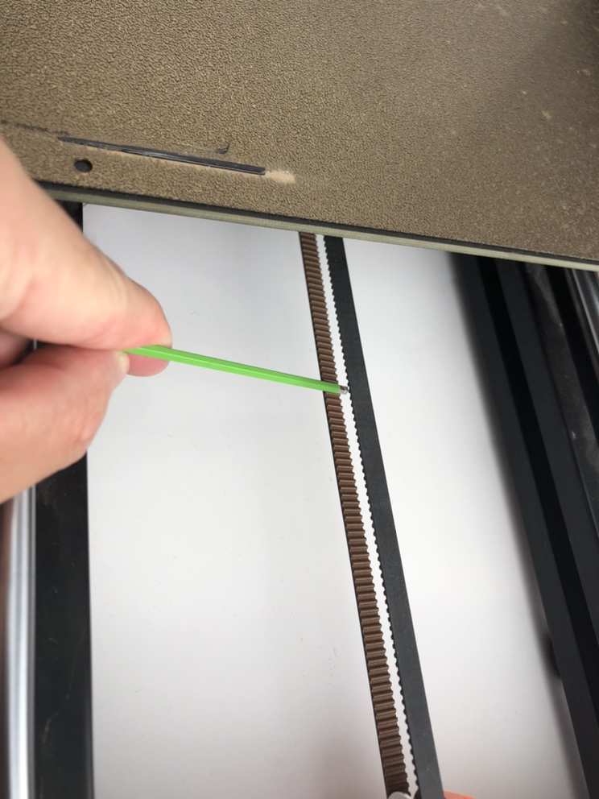
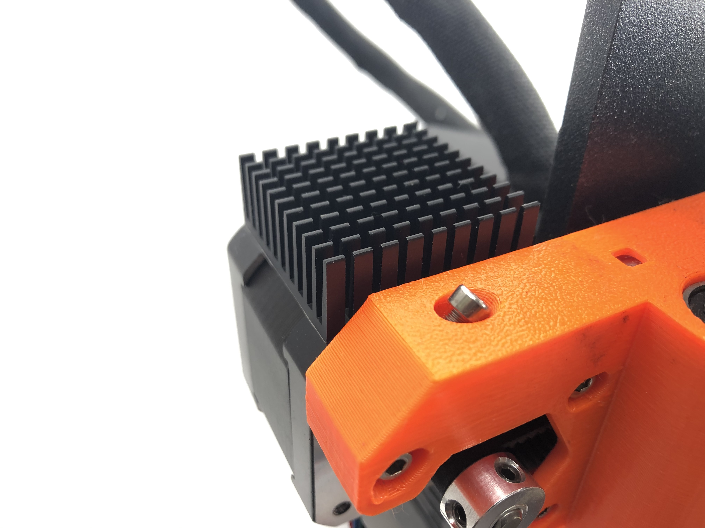

---
hide:
  - navigation
---
# Stage 1:Motor Upgrades

## 1. Preparation and disassembly

### 1.0 Introduction

<span style="color:red"> **READ THE INSTRUCTION BEFORE UPGRADE!!** </span>  

- Prorifi3D XY motor kit is fully compatible with the Original i3 Mk3 series firmware and hardware.  

- Since you are upgrading an existing Original Prusa or clone, you will have to replace X and Y motors, if you have experience in assembling Original i3, that’s perfect! if not, don’t worry, follow this guide, and everything will be smooth and fine.  

- Disclaimer: We share these guides to make your experience as smooth as possible. However, you are responsible for your upgrade, assembly, and any damage you cause to your hardware.  

### 1.1 Check before Upgrade

Make sure you have the following tools and things available in the following 15 minutes:  

1. Your Original i3  

2. 2.5mm, 2mm, and 1.5mm hex keys for disassembly, you can find one 1.5mm hex key in our accessory pack if you do not have one.  

3. A cutting tool for cutting zip ties  

4. Your Prorifi3D motor upgrade kit  

5. A small box for keeping the screws  

6. Printed parts for the new Dual belt (From [Our GitHub](https://github.com/Prorifi3D-Official/Prorifi3D-Upgrades))  

7. Open the Original Prusa i3 MK3S kit assembly Guide for reference([https://help.prusa3d.com/en/guide/1-introduction_24976](https://help.prusa3d.com/en/guide/1-introduction_24976))

8. Make sure you have a flat surface such as a polished marble top, or a big ceramic tile. This surface will be your base level.  

9. **If you have the Original i3 Mk3/s we suggest you upgrade the Y belt holder and tensioner to the Mk3s+ version which allows you better adjust the belt tension **

- Make sure the filament is **unloaded** before the upgrade. You will have to turn the printer over during the process so the filament spool and spool holder need to be removed before the upgrade.

- Make sure your printer is **Not powered**, the nozzle and heated bed are fully cooled to room temperature! Otherwise, you may injure yourself!

- Make sure **both** ends of the power cord is unplugged to allow the printer to be placed sidewise.

## 2. Replace X and Y motors  

### 2.0 Disconnect the wires  

- Unscrew the M3*40 screws on the Einsy-door so you can open it.  

- keep the screw in the small box so you will not lose it.  

- Now, carefully unplug the X and Y motor wires from the mainboard and make sure other wires stay connected.  

- The control box is fixed by two screws located inside the box. You can refer to steps 11-13 in the Electronics assembly in the Original Prusa i3 MK3S kit assembly ([https://help.prusa3d.com/en/guide/8-electronics-assembly_34416](https://help.prusa3d.com/en/guide/8-electronics-assembly_34416)). Use a 2.5mm Allen key to slightly untighten both screws, Do not remove them completely.  

- Carefully push and slide the Einsy base to take it off. Now you can get the X motor wire out of the base completely.  

- Turn the printer so you can reach the bottom of it, and make sure it is sitting still and safe. There are a few zip tiles you need to cut before removing the Y motor. Cut the zips and take the Y motor wires out and keep the others.

<span style="color:red"> Be careful with the wires when you cut the zip tile </span>  

### 2.1 Remove the X motors

- Untighten the screws on the driving pulley to make sure you can remove the pulley from the motor later. There are two screws 90 degrees apart on the pulley.

- Slowly push the E axis away from the X motor side. Use the finger to snap the belt. You should feel some force which means the belt is tight. Now slowly untighten the tension screw and the three screws that fix the X motor with a 2.5mm Allen key until you feel no force between your fingers.

- Now use your hand to assist and hold the X motor so it will not suddenly fall off. Use a 2.5mm Allen key to remove the three screw that holds the X motor. Do not keep the screws.

- Take off the X motor and remove the pulley from the motor.

- Put the motor aside. keep the driving pulley in the box for later use. Leave the belt hanging for now.  

- Cut the zip tile on the sleeve, and remove and keep the sleeve for later use.

### 2.2 Remove the Y motors

- First, turn the printer sidewise with X motors on top and make sure nothing is damaged.

- Slightly release the two screws on the Y belt holder to untighten the Y belt. Keep the screws in the box for later use. Take the Y belt off the driving pulley.

- As you did on the X motor, untighten these set screws on the pulley(both of them), and remove the Y driving pulley.

- Remove the three screws on the Y motor mount and take off the Y motor, put it aside. Do not keep the screws.

### 2.3 Install Prorifi3D Motors

- Install the Prorifi3D Y-motor in the place of the original Y motor. Use M3x8mm screws.

- Collect and organize the Y motor wires. Make them the same as the original motor wires and zip them to secure the wiring.

- Put the sleeve on the Prorifi3D X motor wire just like you did for the original motor. Use a zip tile to secure the sleeve position

- Install the Prorifi3D X motor in the original position, make sure you use M3x16mm screws.

- Reinstall the X driving pulley

- Adjust the position of the X driving pulley, make sure the belt does not touch the edge of the pulley when moving.

- Adjust the tightness of the X belt. We can fine-tune the belt tension later according to the print test. This is because over-tightening the belt can make MRR worse, However, untightening too much will result in the polygon effect which causes the 2mm VFA. So adjusting the belt to an ideal tension is necessary to improve the print quality.

### 2.4 Reinstall the control box

- Open the Einsy door. Reconnect the XY motor wire you took off previously. Close the Einsy door. Take and tighten the M3x40mm screw to close the Einsy door when you finish the electronics.

- Put the Control box back to its original place and tighten the screws to secure the control box. Be careful and make sure the X wire is not pressed or has been snapped by the Control box. The wire should come through the side hole in the control box.

## 3. Belt tension adjust

- First set your belt to the lowest tension. You can use phone apps to determine the vibration frequency of your belt. For the Original i3 Mk3 series the minimum value should be about 54Hz.

- You can use phone apps to measure the belt vibration frequency.

- When measuring the belt frequency, push the heated bed all the way to the back (where the motor is). Slightly picking the lower belt in the middle as shown. You can use a hex key to assist.



- Print the [Test block](https://github.com/Prorifi3D-Official/Prorifi3D-Upgrades/tree/main/Test%20files), you may see there are vertical patterns with 2mm separations on the Y axis. This means your belt is too loose. 

- Slowly tighten the belt, and print the test block. Until you see the 2mm separations disappear completely. This tension should be ideal, you can record the current belt frequency for later reference.

- If you see a 0.64mm separation pattern, that is MRR and your belt is way too tight! Untighten the belt. The ideal tension should be where the 2mm pattern caused by PE is gone and MRR is at its minimal. 

- The recommended tension for Original i3 with Prorifi3D motors is around <span style="color:red">84Hz for the Y axis</span> and <span style="color:blue">57Hz for the X axis</span>.

## 4. Performance boost (optional) 

### 4.1 Install the heat sinks

- To get an extra performance boost, you can install the heatsink first. This will lower the motor running temperature, allowing a larger current and better stability.

- For Y motors we recommend you install as shown:


- For X motors we recommend you install as shown:



### 4.2 Changing the motor current

- You can change the current via Gcode

- First, connect your printer using a USB cable

- Use Pronterface to connect your printer

- Change the RMS current of your XY motor using

```
M907 X520 Y520
```

- Save the settings by typing

```
M500
```

## 5. Remove and replace the E & Z motors (additional)

- For removing and installing Z motors please refer to :[https://help.prusa3d.com/en/guide/4-z-axis-assembly_168629](https://help.prusa3d.com/en/guide/4-z-axis-assembly_168629 )

- Note that in Step 4 Z-axis: assembling the motors, use M3x8 instead of M3x10 

- For removing and installing Z motors please refer to :[https://help.prusa3d.com/en/guide/5-e-axis-assembly_169235](https://help.prusa3d.com/en/guide/5-e-axis-assembly_169235)


